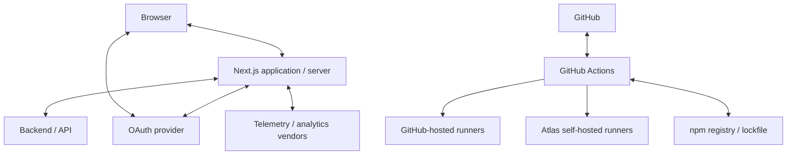

# Atlas threat model

This is a working threat model derived from the Atlas codebase. It is **not** a STRIDE
certification, penetration-test report, or independent security review.

Controls are described only when they exist in the repository. Residual risks and consumer
responsibilities are called out explicitly.

See also: [`SECURITY.md`](../../SECURITY.md), [security engineering](../how-we-build/security.md).

## Assets

| Asset                             | Where it lives                                                                                                      | Notes                                                                                        |
| --------------------------------- | ------------------------------------------------------------------------------------------------------------------- | -------------------------------------------------------------------------------------------- |
| OAuth client ID / secret          | Server env (`GOOGLE_CLIENT_ID`, `GOOGLE_CLIENT_SECRET`)                                                             | Never in client bundles if consumers keep them in `serverEnv`                                |
| Access tokens                     | Encrypted `atlas_session` cookie                                                                                    | Server-side only; `/api/auth/me` must not return them                                        |
| Refresh tokens                    | Same session cookie                                                                                                 | Google may omit on re-auth; rotation is **opportunistic**, not Atlas-owned                   |
| Session ciphertext                | `atlas_session` httpOnly cookie                                                                                     | AES-GCM with key derived from `AUTH_SESSION_SECRET` (PBKDF2, static salt `atlas-session-v1`) |
| OAuth PKCE verifier + state       | `atlas_oauth_tmp` cookie (JSON, **not** encrypted)                                                                  | 5-minute TTL; httpOnly                                                                       |
| User identity / profile           | Session payload; `/api/auth/me` returns email/name/avatar + authz permissions                                       | Tokens excluded from the public session response                                             |
| Backend API authorization context | Server uses `session.accessToken`; UI uses resolved permissions                                                     | Backend remains a separate trust domain                                                      |
| Analytics / consent state         | `@atlas/consent` + analytics adapters; opt-in via env                                                               | Consent is **not** a legal CMP                                                               |
| Telemetry / error data            | Web Vitals route, Sentry, logs                                                                                      | Redaction helpers exist; consumers must use them                                             |
| CI credentials                    | GitHub Actions `GITHUB_TOKEN`, optional `TURBO_*`, `LHCI_GITHUB_APP_TOKEN`, Codecov                                 | Least-privilege workflow `permissions` applied                                               |
| Repository write credentials      | Version PR job (`contents: write`, `pull-requests: write`); GitHub Release job (`contents: write`, `actions: read`) | Fail-closed tag/Release publication; no retag; no npm token                                  |
| npm Trusted Publishing OIDC       | npm-publish job (`id-token: write`, `contents: read`) on push to `main` after GitHub Release                        | GitHub-hosted only; no `NPM_TOKEN`; first package version was a human tarball publish        |
| Release / snapshot artifacts      | Workflow artifacts (Playwright, SBOM, audit JSON)                                                                   | 90-day SBOM retention for snapshots                                                          |
| Self-hosted runner host state     | Persistent disk under `/var/cache/ci` when enabled                                                                  | Trusted-operator domain                                                                      |

## Trust boundaries

Trusted same-repository code may use persistent self-hosted runners. Fork/untrusted PRs may not.

## OAuth and session (verified)

Starter implementation: `apps/web/src/lib/auth/**` and `apps/web/src/app/api/auth/**`. Reference
duplicates the same session/PKCE modules via template sync and adds a `reference` provider.

| Topic               | Actual behavior                                                                                        |
| ------------------- | ------------------------------------------------------------------------------------------------------ |
| OAuth state         | `generateState()` (128 bits); `verifyState()` is constant-time; mismatch redirects `invalid_state`     |
| PKCE                | S256 challenge on the Google authorize URL; verifier stored in `atlas_oauth_tmp`                       |
| Callback validation | Requires `code` and `state`; consumes temp cookie; missing cookie → `missing_state`                    |
| Provider error      | Google `error` query param redirects to `/login?error=…`                                               |
| Redirect / returnTo | Start handler allows only same-origin `pathname + search`; callback redirects to that stored value     |
| Cookies             | Session: httpOnly, `Secure` in production, SameSite=Lax, Path `/`, maxAge from session TTL             |
| Session creation    | After token exchange + userinfo; AES-GCM cookie                                                        |
| Token refresh       | `POST /api/auth/refresh` requires session **and** refresh token; Google refresh may return a new RT    |
| Refresh rotation    | **Not guaranteed.** `refreshAccessToken` keeps the old refresh token if Google omits a new one         |
| Failed refresh      | `/api/auth/me` path: `readGoogleSessionWithRefresh` **returns the existing session** if refresh throws |
| Logout              | `POST /api/auth/logout` sets `atlas_session` to empty with `maxAge: 0`                                 |
| Replay              | Temp cookie is consumed on callback (one-time). Authorization codes are single-use at Google           |
| CSRF                | OAuth state + SameSite=Lax. Cookie-backed session for same-site navigations                            |

The OAuth temp cookie is **plaintext JSON** (verifier + state + returnTo). httpOnly and short TTL
reduce XSS theft; they do not encrypt the verifier at rest in the browser cookie jar.

## Browser threats

| Threat                        | Atlas control                                                                                        | Residual                                                            |
| ----------------------------- | ---------------------------------------------------------------------------------------------------- | ------------------------------------------------------------------- |
| XSS                           | CSP builder + per-request nonce in `proxy.ts`; default **CSP_MODE is off** until consumers enable it | Enabling CSP is a consumer configuration duty                       |
| CSRF                          | SameSite=Lax session cookie; OAuth state                                                             | Cross-site GET navigation still sends Lax cookies                   |
| Open redirect                 | `returnTo` origin check on OAuth start                                                               | Callback trusts the stored relative path                            |
| Token leakage to JS           | httpOnly session cookie; `/api/auth/me` omits tokens                                                 | Server logs/telemetry must use redaction                            |
| Cookie theft                  | Secure in production; httpOnly                                                                       | XSS + mis-set Secure in non-HTTPS deploys                           |
| CSP bypass / misconfiguration | Allowlists from env (`CSP_*`)                                                                        | `'unsafe-inline'` for styles exists in the CSP builder for Tailwind |
| Malicious third-party script  | CSP script-src nonce + allowlist when enforced                                                       | Off by default                                                      |

## Supply-chain / build

| Threat                             | Control                                                                                                                                                        |
| ---------------------------------- | -------------------------------------------------------------------------------------------------------------------------------------------------------------- |
| Malicious / vulnerable npm package | Frozen lockfile CI, Atlas audit policy (HIGH/CRITICAL), Renovate                                                                                               |
| Lockfile manipulation              | CI lockfile-up-to-date check; forbidden alternate lockfiles                                                                                                    |
| GitHub Action compromise           | SHA-pinned remote actions; full-SHA allow-rule in workflow check                                                                                               |
| Mutable container tags             | Gitleaks pinned by digest                                                                                                                                      |
| Secret leakage in git              | Gitleaks git-history scan of the CI checkout (`fetch-depth: 0`); history fixture proves committed-then-deleted secrets are detected                            |
| Artifact tampering                 | Exact packed `.tgz` is hashed before npm publish; OIDC provenance on later publishes; first npm version was a human-authenticated publish of that same tarball |

`pnpm audit` is **not** complete application security.

## Self-hosted runners

When `ATLAS_CI_RUNNER_PROFILE=self-hosted`:

**Mitigated in workflow:** only the main-pinned reusable workflow
(`.github/workflows/trusted-self-hosted.yml`) may target the `Blitzcraft Trusted CI` runner group;
fork PRs cannot select the persistent runner; checkout lands in `github.workspace` like hosted
runners; job temp HOME; Playwright E2E in a container as the runner user.

**Trusted-operator residual (not fully mitigated by Atlas):** persistent pnpm/Turbo caches; Docker
daemon access on the host (E2E uses Docker); host network for Playwright container; workspace
contamination across jobs if cleanup fails; malicious `postinstall` scripts from dependencies on a
trusted branch; Docker socket if operators expose it (Atlas workflows do not mount
`/var/run/docker.sock` except as required for `docker run` from the job).

Operators must treat the runner host as equivalent to **write access to the canonical repository**.

## Telemetry and logging

- `lib/security/redact.ts` removes sensitive keys and some token-like strings.
- Web Vitals payloads include a `sessionId` that is a reporting identifier, not the auth session
  cookie.
- Sentry is optional via DSN; the Next.js `proxy` sets correlation tags.
- Consumers are responsible for not logging `accessToken` / cookies in product code.

## Abuse-case table

| Threat                        | Entry point                  | Asset                 | Impact                          | Mitigation                          | Detection                 | Residual risk                             | Owner / consumer         |
| ----------------------------- | ---------------------------- | --------------------- | ------------------------------- | ----------------------------------- | ------------------------- | ----------------------------------------- | ------------------------ |
| OAuth CSRF                    | `/api/auth/google/callback`  | Session               | Account login CSRF              | State cookie + `verifyState`        | Redirect `invalid_state`  | Stolen temp cookie                        | Atlas                    |
| Missing PKCE verifier         | Callback without temp cookie | Tokens                | Auth code exchange fails        | Missing cookie → `missing_state`    | Login error query         | —                                         | Atlas                    |
| Open redirect                 | `?returnTo=` on start        | User browser          | Phish after login               | Same-origin check                   | Ignored returnTo          | Stored path still attacker-influenced     | Atlas + consumer URLs    |
| Refresh without session       | `POST /api/auth/refresh`     | Auth state            | No silent login                 | 401                                 | 401                       | —                                         | Atlas                    |
| Refresh without refresh token | Same                         | Auth state            | 400, no new session             | 400                                 | 400                       | Failed me-path refresh keeps old session  | Atlas                    |
| Logout cookie leftover        | `POST /api/auth/logout`      | Session cookie        | Session should end              | maxAge 0, httpOnly                  | Cookie cleared            | Browser cookie UI lag                     | Atlas                    |
| Token in `/api/auth/me`       | GET me                       | Access/refresh tokens | XSS theft                       | Response omits tokens               | Tests                     | Permissions still revealed                | Atlas                    |
| XSS → cookie theft            | Injected script              | Session cookie        | Account takeover                | httpOnly; CSP when enabled          | CSP reports if configured | CSP off by default                        | Consumer (`CSP_MODE`)    |
| Vulnerable HIGH npm package   | `pnpm install`               | Build / runtime       | Known CVE                       | Blocking audit policy               | Security Audit job        | Transitive, unfixed upstream              | Maintainers + exceptions |
| Fork PR on self-hosted        | `pull_request` from fork     | Runner host           | Arbitrary code on persistent VM | Trust check → GitHub-hosted only    | Workflow validator        | Operator misconfig                        | Maintainers              |
| Mutable Action tag            | Workflow edit                | CI integrity          | Supply-chain                    | SHA pin + `security:workflow-check` | CI                        | Compromised SHA still trusted             | Maintainers              |
| Secret committed              | Git push                     | Credentials           | Credential leak                 | Gitleaks history scan + fixture     | Secrets Scan              | Unfetched remote refs; undetected formats | Maintainers + consumers  |
| PII in logs                   | Logger / Sentry              | User data             | Privacy                         | Redact helpers                      | Code review               | Ad-hoc `console.log`                      | Consumers                |

## Out of scope for this document

- Formal STRIDE certification
- Paid SAST/DAST products
- Independent penetration testing
- Public npm publication security
